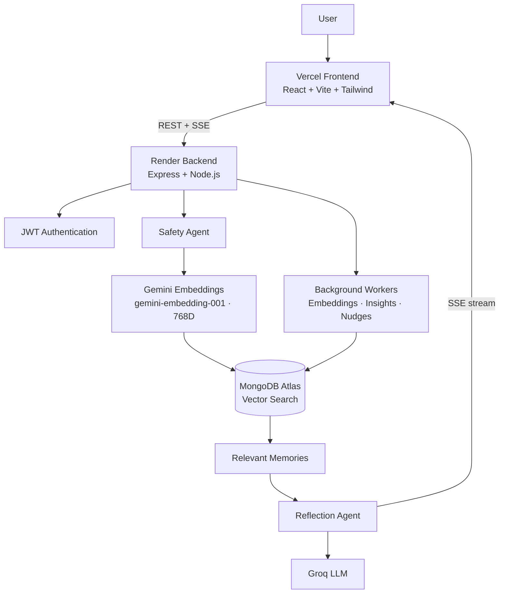

<p align="center">
  
</p>


<div align="center">
  <h1>Wellspring</h1>
  <p>AI-powered reflective journaling and personal growth platform</p>
</div>

Wellspring is a full-stack wellness application that combines journaling, conversational reflection, semantic memory retrieval, safety classification, and growth insights in a single system.

## Architecture



## Core Stack

| Layer          | Technology                                        |
| -------------- | ------------------------------------------------- |
| Frontend       | React, Vite, Tailwind CSS, React Router, Three.js |
| Backend        | Node.js, Express                                  |
| Database       | MongoDB Atlas + Vector Search                     |
| Authentication | JWT + bcrypt                                      |
| LLM            | Groq                                              |
| Embeddings     | Gemini `gemini-embedding-001` (768 dimensions)    |
| Streaming      | Server-Sent Events (SSE)                          |
| Scheduling     | `node-cron`                                       |
| Deployment     | Vercel + Render                                   |

## Core Flow

```text
User Message
    ↓
Safety Classification
    ↓
Gemini Embedding
    ↓
MongoDB Vector Retrieval
    ↓
Relevant Personal Context
    ↓
Groq Reflection Agent
    ↓
SSE Streamed Response
```

Journal entries and chat messages can be embedded and retrieved as semantic memories. Retrieval is scoped to the authenticated user, while safety classification is performed before the general reflection flow.

## Project Structure

```text
wellspring/
├── wellspring-frontend/     # React client
├── wellspring-backend/      # Express API and AI services
└── README.md
```

## Local Development

### Backend

```bash
cd wellspring-backend
npm install
cp .env.example .env
npm run create-vector-indexes
npm run dev
```

### Frontend

```bash
cd wellspring-frontend
npm install
cp .env.example .env
npm run dev
```

Set the frontend API URL with:

```env
VITE_API_URL=http://localhost:4000
```

The backend requires MongoDB, JWT configuration, Groq credentials, Gemini credentials, and embedding configuration. See `wellspring-backend/.env.example` for the full set of variables.

## Production

* Frontend: Vercel
* Backend: Render
* Database: MongoDB Atlas
* Vector indexes: `journal_entries_vector_index`, `chat_messages_vector_index`
* Embedding model: `gemini-embedding-001`
* Embedding dimensionality: `768`

Before production use, ensure the MongoDB vector indexes are ready and existing documents have been embedded with the active Gemini embedding configuration.

## Status

Wellspring is an active project and continues to evolve as new AI, retrieval, and community features are developed.
